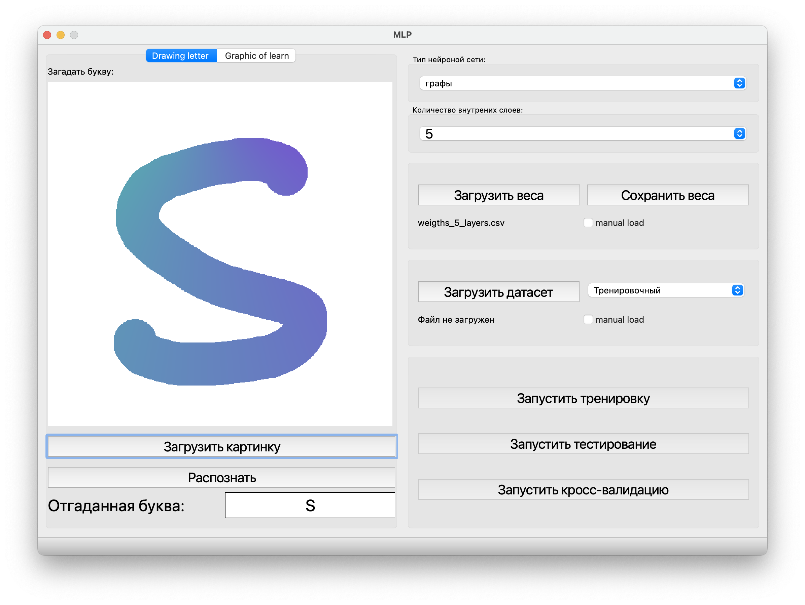
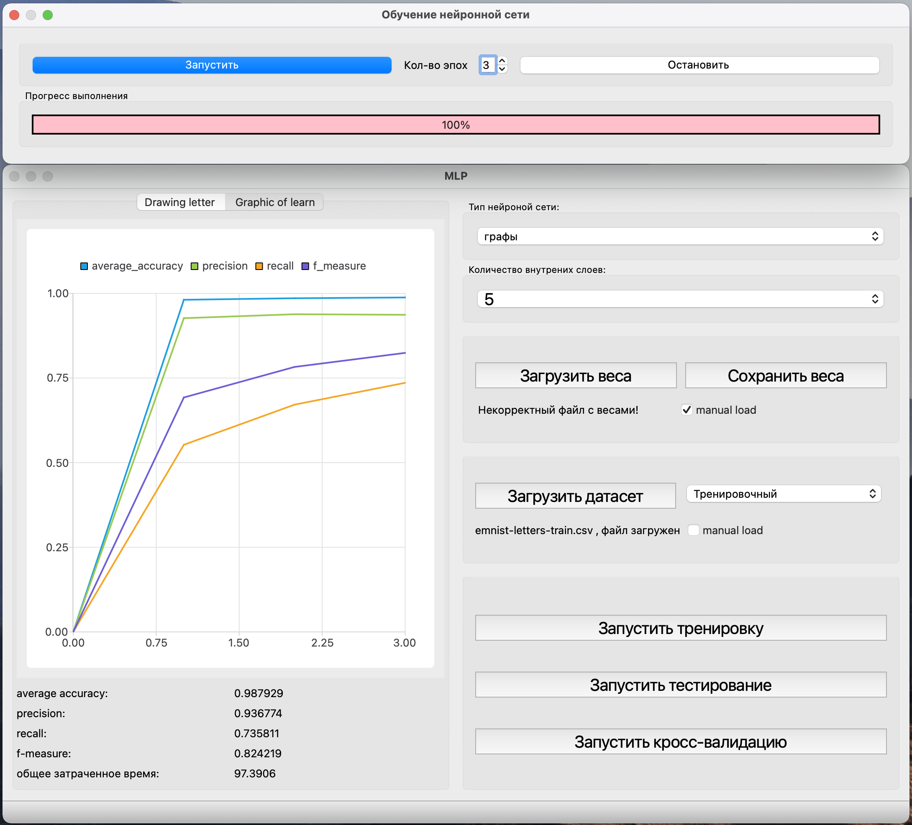
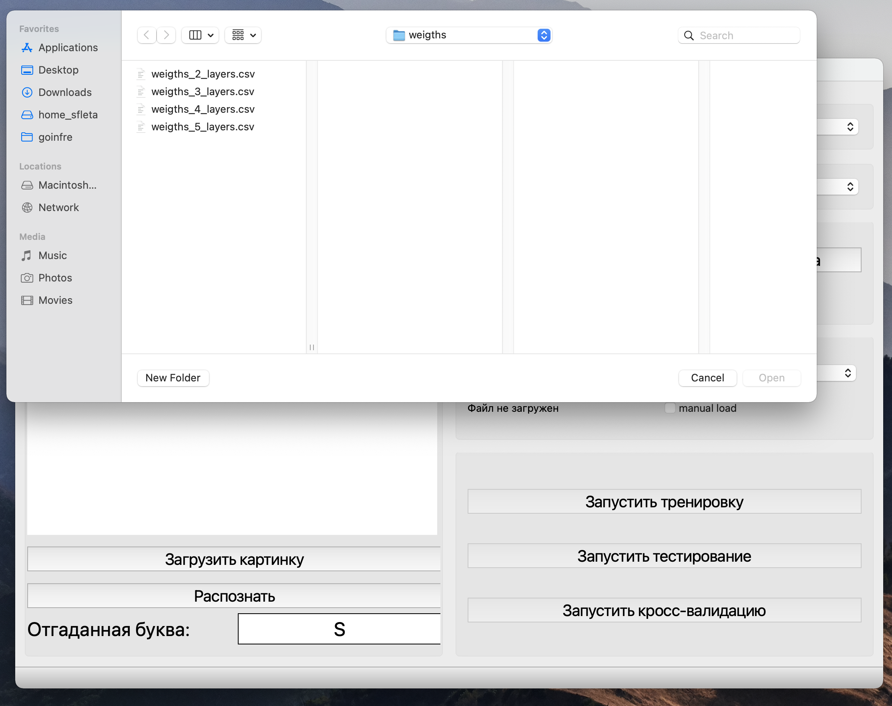
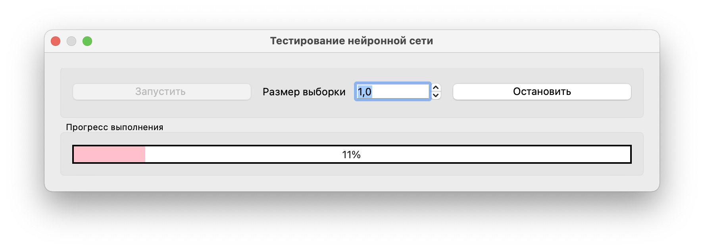
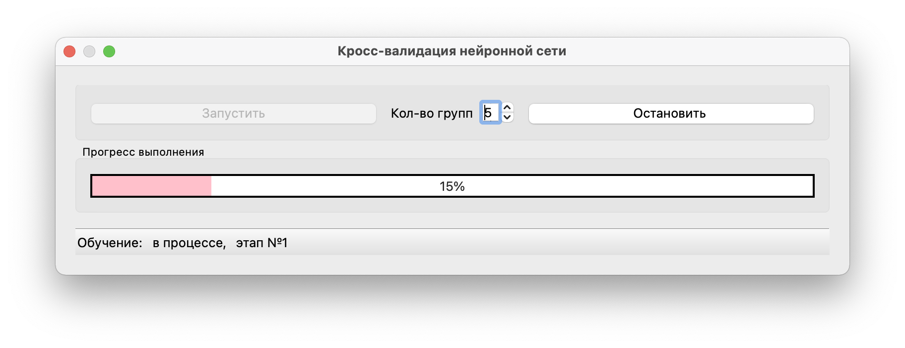

MLP v1.0 User's Manual

Данный проект представляет собой реализацию нейронной сети для распознания рукописных букв латинского алфавита. 

авторы: \
Руслан zgeorgan(backend графовой реализации, user interface) \
Эдуард cnathali(общий backend, backend графовой и матричной реализации, user interface) \
Евгений sfleta(backend матричной реализации, user interface)

Реализованы возможности:

1) Переключатель вкладок полотна для рисования и графика обучения, переключение осуществляется кликом на соотвествующую вкладку.
2) Полотно для рисования букв с помощью движения курсора мыши с зажатой левой кнопкой мыши, очистка полотна осуществляется через клик правой кнопкой мыши.
3) Загрузка картинки, в формате BMP, с нарисованной буквой для дальнейшего распознания.
4) Распознание изображения на полотне при нажатии на клавишу, для распознания необходимо чтобы полотно было заполненно вручную или из загруженной картинки, для успешного распознания необходимо заранее загрузить веса.
5) Отображение ответа нейросети в виде отгаданной буквы
6) Выбор типа реализации нейросети на матрицах или графах
7) Выбор количества скрытых слоев нейросети
8) Загрузка и сохранение весов нейросети из файла, после нажатия на кнопку необходимо выбрать путь до файла при загрузке, или имя файла при сохранении. 
По умолчанию заранее подготовленные веса загружаются в зависимости от выбора количества внутренних слоев.
Чекбокс "manual load" позволяет самостоятельно выбрать фаил для загрузке, необходимо выбирать файл с весами соответвующий количеству внутренних слоев.

9) Кнопка загрузки датасета, работает аналогичным образом, есть возможность выбрать из 2 подготовленных файлов, либо выбрать фаил самостоятельно.
10) Блок кнопок отвечающих за: тренировку, тестирование, кросс-валидацию нейросети - по-умолчанию заблокированы, если не загружен датасет.
11) При клике на кнопку тренировки открывается отдельное окно с возможностью выбора количество эпох тренировки, после запуска есть возможность прервать процесс на кнопку остановить. В процессе работы обучение, состояние каждой эпохи можно видеть на прогрес-баре, и после каждой эпохи происходит тестирование, результат тестирования, в виде графика и значения метрик(под графиком) на текущей эпохе.

12) При клике на кнопку тестирование открывается отдельное окно с возможностью выбора размера выборки для тестирования(от 0 до 1, где 0 это ничего, а 1 вся выборка), после запуска есть возможность прервать процесс на кнопку остановить. Также происходит отображение результатов в вкладке график.

13) При клике на кнопку кросс-валидация открывается отдельное окно с возможностью выбора количества групп(на какое количество будет разделяться датасет), после запуска есть возможность прервать процесс на кнопку остановить. Внизу окна есть статус-бар где отображается текущее состояние процесса. Также происходит отображение результатов в вкладке график.
